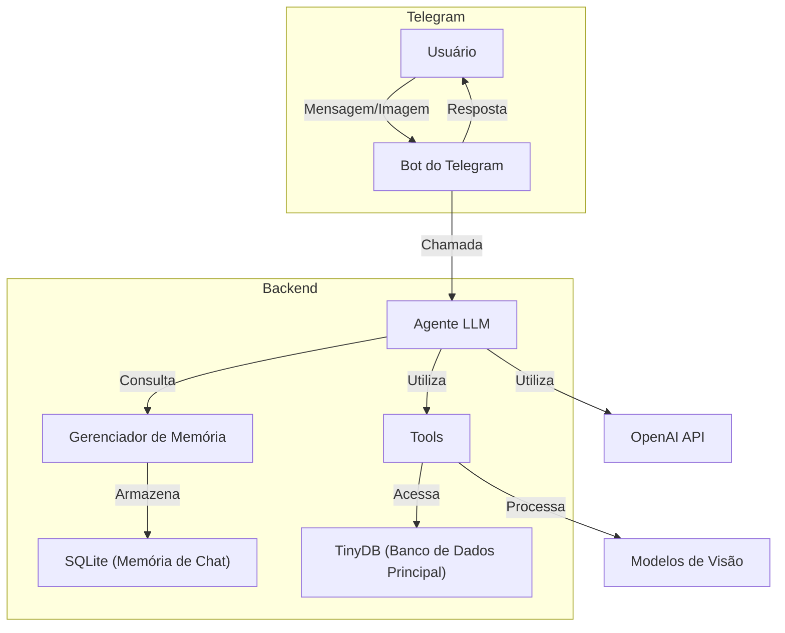

# 🧠 Telegram LLM Agent (Nutrição como caso de uso)

Projeto de **estudo aplicado** para experimentação de **agentes baseados em Large Language Models (LLMs)**, integrados ao **Telegram**, com uso de ferramentas, memória conversacional, processamento de imagens e persistência de dados.

O domínio de **nutrição** é utilizado exclusivamente como **caso de uso** para explorar decisões arquiteturais, integração entre componentes e padrões de agentes com IA — não como produto final nem solução clínica.

---

## 📌 Visão Geral

Este projeto implementa um **agente conversacional com LLM**, capaz de interagir com usuários via Telegram, manter contexto de conversa, decidir dinamicamente quando acionar ferramentas especializadas, persistir dados estruturados e processar imagens enviadas pelo usuário.

O foco principal está em **arquitetura de agentes**, **IA aplicada** e **organização de sistemas**, utilizando um domínio realista apenas como cenário de experimentação.

---

## ⚠️ Aviso Importante

Este projeto tem caráter **educacional e experimental**.

Ele **não substitui** consultas, diagnósticos ou tratamentos realizados por profissionais de saúde qualificados.  
As interações e respostas geradas pelo agente **não devem ser utilizadas como aconselhamento médico ou nutricional profissional**.

---

## 🎯 Objetivos do Projeto

- Arquitetura de agentes baseados em LLM  
- Uso de ferramentas (tools) acionadas pelo agente  
- Integração de LLMs com aplicações externas (Telegram)  
- Persistência de dados e memória conversacional  
- Processamento de imagens com apoio de modelos de visão  
- Organização de código orientada à evolução e experimentação  

---

## 🧠 O que este projeto é

- Um **experimento arquitetural de agente com LLM**
- Um **projeto de estudo aplicado**
- Um laboratório para entendimento de agentes conversacionais, ferramentas, memória e persistência

---

## 🚫 O que este projeto NÃO é

- Um produto comercial  
- Um sistema validado para uso em saúde  
- Um chatbot pronto para produção  
- Uma solução enterprise  

---

## 🏛️ Arquitetura



---

## 🧱 Componentes da Arquitetura

### Usuário
Interage com o sistema por meio do Telegram, enviando mensagens de texto ou imagens.

### Bot do Telegram
Atua como interface de comunicação, encaminhando mensagens ao agente e retornando as respostas ao usuário.

### Agente LLM
Componente central responsável por interpretar intenções, manter contexto, decidir quando acionar ferramentas e gerar respostas contextuais.

### Gerenciador de Memória
Armazena o histórico de conversas em **SQLite**, permitindo continuidade e contexto entre interações.

### Tools (Ferramentas)
Ferramentas especializadas acionadas dinamicamente pelo agente (registro de dados, análise de imagens, geração de relatórios, lembretes, etc.).

### Banco de Dados
- **TinyDB**: persistência principal de dados estruturados  
- **SQLite**: armazenamento da memória conversacional

### OpenAI API
Utilizada para processamento de linguagem natural e geração de respostas do agente.

---

## 🗄️ Arquitetura do Banco de Dados

Mais detalhes disponíveis em:  
[docs/database_diagram.md](docs/database_diagram.md)

---

## 🛠️ Tecnologias Utilizadas

- Python 3.12+  
- LangChain  
- OpenAI API  
- TinyDB  
- SQLite  
- Pyrogram  
- Modelos de Visão (ex: BLIP)

---

## ✨ Funcionalidades

- Conversação contextual com memória persistente  
- Processamento de imagens enviadas pelo usuário  
- Registro estruturado de dados  
- Geração de relatórios  
- Agendamento de lembretes  
- Código modular e extensível  

---

## ⚙️ Pré-requisitos

- Python 3.12+  
- Docker (opcional)  
- Chave de API OpenAI  
- Credenciais da API do Telegram  

---

## 🚀 Instalação e Execução

### 🐳 Com Docker

```bash
git clone https://github.com/MariliaGQ/smart-nutri-ai.git
cd smart-nutri-ai
./bin/build.sh
```

---

### 💻 Sem Docker

```bash
git clone https://github.com/MariliaGQ/smart-nutri-ai.git
cd smart-nutri-ai
python -m venv venv
source venv/bin/activate
pip install -r requirements.txt
python nutritionist/app.py
```

Configure as variáveis de ambiente conforme `.env-example`.

---

## 📚 Observações

Este projeto foi desenvolvido com foco em **aprendizado, arquitetura e experimentação consciente em Engenharia de IA**.
